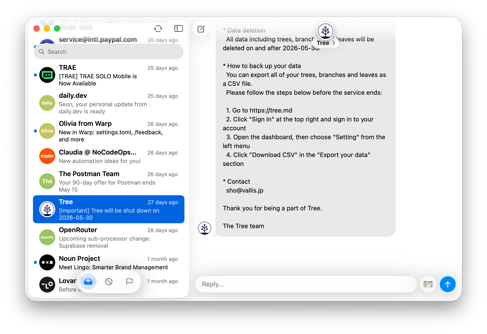
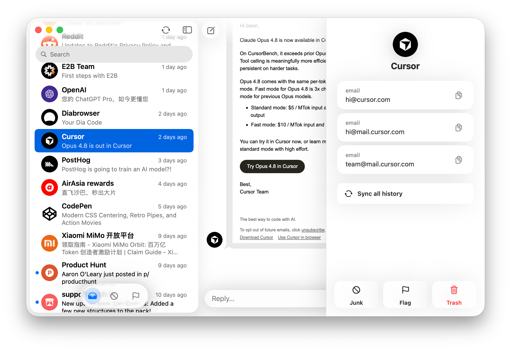

<div align="center">
  <br />
  
  <h1>Mailia</h1>
  <p>A native macOS email companion that turns multiple mailboxes into a people-first inbox.</p>
  <p>
    <a href="./LICENSE">License</a>
    &nbsp;·&nbsp;
    <a href="./CREDITS.md">Credits</a>
    &nbsp;·&nbsp;
    <a href="./CONTRIBUTING.md">Contributing</a>
    &nbsp;·&nbsp;
    <a href="./SPARKLE.md">Updates</a>
  </p>
  <br />
</div>

Mailia starts from senders, organizations, and services instead of accounts,
folders, and message lists. It uses Himalaya as the mail transport layer and
builds a local SwiftUI experience for browsing cross-account email history like
a lightweight IM timeline.

The product requirements live in [docs/requirements.md](docs/requirements.md).

## Screenshots

<table>
  <tr>
    <td align="center"></td>
    <td align="center"></td>
  </tr>
</table>

## Features

- People-first inbox across configured Himalaya accounts.
- Local Swift database for mailbox metadata, sync checkpoints, and sender
  grouping.
- Timeline-style conversation view with a bundled React/WebKit message island.
- HTML email normalization and sanitizer behavior designed for untrusted mail.
- Remote image blocking with layout-preserving placeholders.
- Reply and compose workflows through the configured Himalaya transport.
- Sparkle update metadata and GitHub release automation.

## Requirements

- macOS 26.0 or newer.
- Xcode 26.4 or a compatible Swift 6.2 toolchain for development builds.
- Node.js 22 for rebuilding the timeline web island.
- [Himalaya](https://github.com/pimalaya/himalaya) installed and configured for
  mail access.

Mailia does not manage provider OAuth, app passwords, or IMAP/SMTP credentials.
Those credentials remain in the user's Himalaya configuration.

## Install and Run From Source

Clone and prepare the project:

```bash
git clone https://github.com/rhinoc/mailia.git
cd mailia
npm --prefix Web/Timeline ci
npm --prefix Web/Timeline run build:app
swift build
swift test
```

Run the app from the package:

```bash
swift run Mailia
```

Create a local release DMG:

```bash
npm --prefix Web/Timeline ci
MAILIA_ALLOW_ADHOC_SIGNING=1 scripts/build_release.sh
```

## Himalaya Setup

Mailia discovers accounts and performs mail operations through Himalaya
commands such as:

```bash
himalaya account list -o json
himalaya folder list -a <account> -o json
```

Configure Himalaya before launching Mailia. Mailia looks for the normal
Himalaya configuration locations, and also respects `HIMALAYA_CONFIG` when it
is set.

## Local Data and Privacy

Mailia is a local macOS app. It stores app-managed state and synced mail
metadata locally, while credentials stay with Himalaya.

| Data | Location or owner |
| --- | --- |
| Provider credentials and OAuth tokens | Himalaya configuration and credential storage |
| Mailia database and app state | Mailia application support storage |
| Attachment downloads | User-selected or configured download directory |
| Timeline web assets | Bundled app resources generated from `Web/Timeline` |

HTML email is treated as untrusted content. Mailia sanitizes message display,
filters unsafe links and styles, and blocks remote images by default while
preserving message layout.

## Development

Run frontend type checking:

```bash
npm --prefix Web/Timeline run typecheck
```

Rebuild the timeline web island and copy it into the app bundle resources:

```bash
npm --prefix Web/Timeline run build:app
```

Run the Swift test suite:

```bash
swift test
```

Current targets:

- `MailiaCore`: shared models, Himalaya bridge, sync policy, database schema,
  grouping rules, and HTML sanitization.
- `MailiaApp`: native SwiftUI/AppKit shell, timeline state, reply composer,
  avatar resolution, and Sparkle integration.

For pull request expectations, test data rules, and release boundaries, read
[CONTRIBUTING.md](./CONTRIBUTING.md).

## Third-Party Notices

Original project source code is licensed under the Mozilla Public License 2.0.
See [LICENSE](./LICENSE).

Third-party dependencies and generated data keep their own licenses and terms.
See [CREDITS.md](./CREDITS.md).

Sparkle update signing and GitHub release setup are documented in
[SPARKLE.md](./SPARKLE.md).
